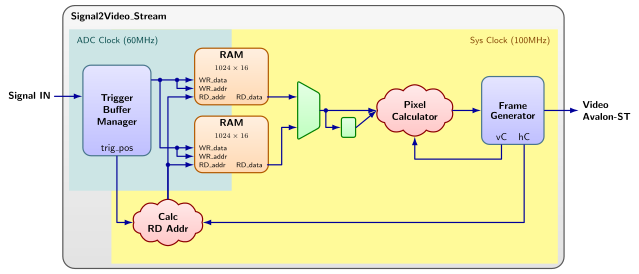

Uno de los elementos fundamentales del trabajo es el **diseño y verificación de la IP de un osciloscopio digital**.

Se os proporciona unos ficheros fuente ([Signal2Video_Stream.zip](../files/Signal2Video_Stream.zip)) que implementa la estructura general de un osciloscopio digital. A partir de este proyecto deberéis **desarrollar vuestra propia IP**, completando los bloques necesarios para capturar y visualizar la señal.

El proyecto incluye módulos que forman parte de la arquitectura del sistema, entre ellos:

- `Signal2Video_Stream`
- `Trigger_Buffer_Manager`
- `Video_AvalonST_Frame_Generator`
- Sincronizadores de **clock domain crossing (CDC)**

A partir de esta base deberéis diseñar e integrar, como mínimo, los elementos necesarios para implementar el comportamiento del osciloscopio. Estos puntos son requisitos obligatorios, pero no limitan el alcance del proyecto: a partir de ellos, podéis incorporar las funcionalidades adicionales que consideréis oportunas. En particular, debéis implementar:

- La lógica de **trigger**.
- El **escalado vertical** de la señal capturada.
- El **escalado horizontal** o base de tiempos.

### Arquitectura general del sistema

El sistema completo implementa un **osciloscopio digital simplificado** que:

1. Captura muestras digitales procedentes de un ADC.
2. Detecta condiciones de **trigger** para estabilizar la visualización.
3. Almacena temporalmente las muestras en memoria.
4. Convierte las muestras en coordenadas de pantalla.
5. Genera un flujo de vídeo que representa la forma de onda.

Módulos del proyecto:

- `Signal2Video_Stream`: Es el módulo principal del sistema. Integra la captura de muestras, la gestión de los buffers y la generación de la información gráfica que se enviará al sistema de vídeo. Recibe las dos señales digitalizadas, coordina la lectura de las memorias de captura, aplica la conversión de las muestras a coordenadas verticales de pantalla y decide qué píxeles deben activarse para dibujar la traza. Además, instancia los otros dos bloques principales del diseño: el gestor de captura con trigger y el generador del flujo de vídeo Avalon-ST.
- `Trigger_Buffer_Manager`: Se encarga del proceso de captura de muestras en el dominio de reloj de muestreo. Controla la dirección de escritura en memoria, el inicio y parada de la captura y la detección del trigger a partir del nivel seleccionado y del canal elegido. Su función es determinar en qué posición del buffer se ha producido el disparo y conmutar entre buffers para que una captura pueda mostrarse mientras se prepara la siguiente.
- `Video_AvalonST_Frame_Generator`: Genera el flujo de vídeo en formato Avalon-ST a partir de los valores de color calculados para cada píxel. Internamente implementa los contadores horizontal y vertical del frame, identifica la zona activa de imagen y genera las señales de control del interfaz de vídeo, como `valid`, `startofpacket` y `endofpacket`. También proporciona una señal de sincronismo de frame que se utiliza para coordinar la captura y la visualización.

En la Figura 1 se muestra el diagrama de bloques general del `Signal2Video_Stream`. El diagrama se ha simplificado mostrando solamente 1 canal de los 2 existentes y obviando diversas señales.

### Verificación

El sistema deberá verificarse mediante:

- **Análisis temporal estático** para comprobar que el diseño puede funcionar a las frecuencias de reloj deseadas (60MHz para la captura de señales del ADC y 100MHz para la generación del streaming de vídeo).
- **Generación de frames con testbench HDL.** En el proyecto que os hemos ofrecido existe un testbench en el directorio `tsb`. Este testbench genera varios frames cambiando valores de `DRAW_DOT` y `SCAL` en cada frame y genera un fichero csv. Además también hay un script python (`plot_stream_frames.py`) que a partir de ese fichero csv genera un fichero png de cada frame para poder ver el resultado. Modificad el testbench para añadir las diferentes funcionalidades que habéis añadido al módulo.
