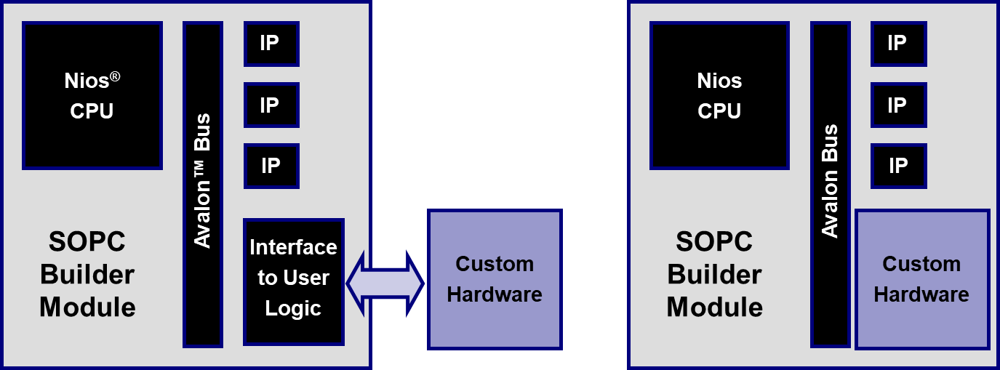
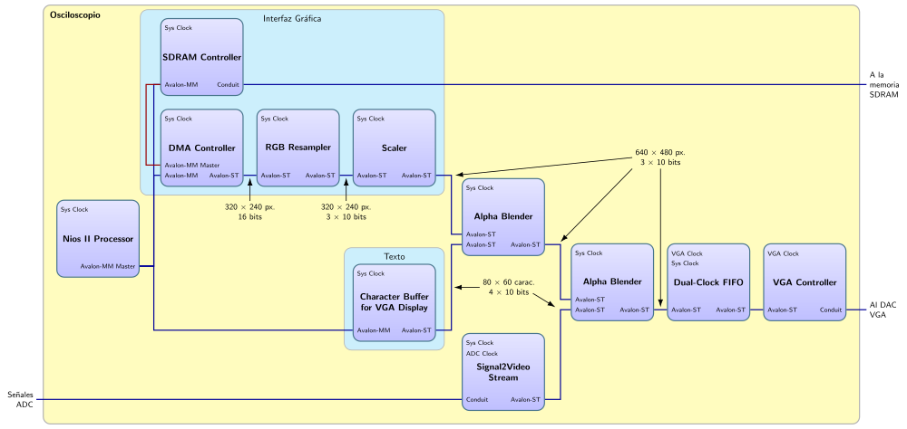

Cuando ya tengáis la IP perfectamente verificada con un interfaz de acceso usuario directo, tenemos que ver cómo acceder con interfaces accesibles desde el microprocesador NIOS 2. Para ello tendréis que:

### 1. Interfaz Avalon Slave

Añadir un interfaz Avalon slave a vuestra IP. En este punto es importante tomar una decisión de diseño que será si introducimos la IP dentro o fuera del sistema del Platform Designer (ver Figura 2).



1.1 Si lo hacéis dentro, deberéis generar el componente con vuestro core IP y el interfaz (parecido a cómo hicisteis con el timer). Ese componente se deberá incorporar al Platform Designer como ya sabéis hacer y eso obligará a regenerar el código HDL.

1.2 Si lo hacéis fuera, solo tendréis que incluir dentro del Platform Designer el interfaz (que será también un nuevo componente y que también os obligará a regenerar el HDL por haber cambiado el Platform Designer).

**Nota importante:** A la hora de crear la interfaz de Avalon Streaming del IP en Platform Designer es muy importante tener en cuenta el parámetro `Ready latency`, que indica el número de ciclos de retardo entre la señal de `ready` que recibimos y la señal de `valid` que enviamos. Esto nos permite segmentar nuestro sistema para subir la frecuencia máxima de reloj.

### 2. A nivel de sistema

Deberéis realizar un sistema que, partiendo del proyecto de sistema del Bloque I de la asignatura, pueda incorporar los pines de acceso a los convertidores de alta velocidad de la placa accesoria. Para ello hay que añadir las entradas y salidas correspondientes a la placa accesoria de ADC y DAC y actualizar la asignación de pines incluyendo estos pines ([DE1_SoC_Oscilloscope.csv](../files/DE1_SoC_Oscilloscope.csv)).

```verilog
//////////// High Speed ADC/DAC //////////
output                          ADC_CLK_A,
output                          ADC_CLK_B,
input              [13:0]       ADC_DA,
input              [13:0]       ADC_DB,
output                          ADC_OEB_A,
output                          ADC_OEB_B,
input                           ADC_OTR_A,
input                           ADC_OTR_B,
output                          DAC_CLK_A,
output                          DAC_CLK_B,
output logic signed [13:0]      DAC_DA,
output logic signed [13:0]      DAC_DB,
output                          DAC_MODE,
output                          DAC_WRT_A,
output                          DAC_WRT_B,
input                           OSC_SMA_ADC4,
output                          POWER_ON,
input                           SMA_DAC4
```

Además, habrá que generar una señal de reloj con un PLL de 60MHz para los ADC y conectar dicho reloj a las salidas `ADC_CLK_A` y `ADC_CLK_B`. Las señales `ADC_OEB_A` y `ADC_OEB_B` son los enables a nivel bajo de los dos canales de ADC y en las señales `ADC_DA` y `ADC_DB` tenemos los datos de entrada de los ADC. La señal `POWER_ON` hay que conectar a nivel alto para que funcionen los conversores; el resto de señales no es necesario utilizarlas.

Una vez añadidas las entradas y salidas correspondientes al ADC hay que actualizar el sistema de visualización introduciendo el módulo implementado en el sistema. Para poder introducirlo necesitamos también introducir otro Alpha Blender como se puede ver en la Figura 3.



### 3. A nivel de verificación

Debéis verificar (a través del bus Avalon slave) el manejo adecuado de la PIO que gobernará vuestra IP o directamente vuestro core IP (dependiendo de la opción utilizada en el punto 1). Preparad la estrategia derivada de vuestra experiencia en la verificación de vuestro timer para realizar esta verificación y utilizad la generación del fichero csv y frames en png de la verificación del objetivo 1.

### 4. A nivel de software

El proyecto software debería gestionar todo un interfaz de usuario con entrada a través del teclado PS2 y que todo fuera controlado a través del sistema operativo en tiempo real.

Figura 4. DE1-SoC con placa accesoria de conversores ADC y DAC (en el HTML original se referencia una imagen externa que no está disponible en `img/`).
